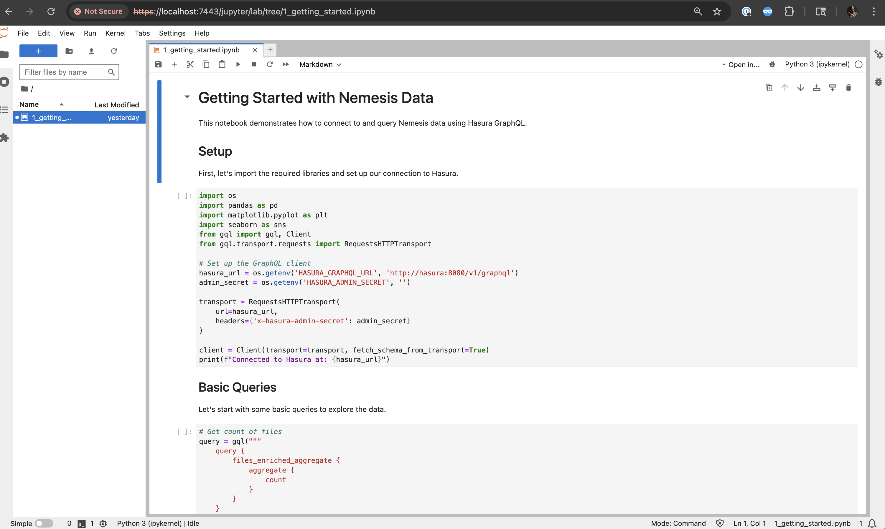

# Jupyter Notebooks

Jupyter Lab environment for exploring Nemesis data through interactive notebooks with direct access to Hasura GraphQL and PostgreSQL.

## Overview

The Jupyter service provides a powerful data analysis environment that allows you to:

- Query Nemesis data using Hasura GraphQL
- Perform advanced data analysis and visualization
- Create custom investigations and reports
- Explore file metadata, enrichment results, and security findings

## Access

When Nemesis is running, Jupyter is available at:

**URL**: `https://your-nemesis-host/jupyter/`

This is also linked to by the Nemesis `Help` menu.

## Authentication

### Environment Variable Password

Use the `JUPYTER_PASSWORD` environment variable password to log in.

## Getting Started

### 1. Sample Notebooks

The service comes with pre-configured sample notebooks:

- **`1_getting_started.ipynb`**: Introduction to querying Nemesis data with examples

### 2. Pre-installed Libraries

The Jupyter environment includes:

- **Data Analysis**: pandas, numpy, matplotlib, seaborn, plotly
- **GraphQL Client**: gql[requests] for Hasura queries
- **Database Access**: psycopg2-binary for direct PostgreSQL connections
- **Utilities**: ipywidgets, python-dotenv

### 3. Environment Variables

The following environment variables are automatically configured:

- `HASURA_GRAPHQL_URL`: GraphQL endpoint (`http://hasura:8080/v1/graphql`)
- `HASURA_ADMIN_SECRET`: Admin secret for Hasura access
