# Nemesis Usage Guide

This page covers usage of Nemesis after the system is properly [setup](quickstart.md).

For a general overview of the Nemesis project structure, see the [overview](overview.md).

- [Nemesis Usage Guide](#nemesis-usage-guide)
  - [Data Ingestion](#data-ingestion)
    - [Nemesis C2 Connector Setup](#nemesis-c2-connector-setup)
  - [Nemesis Dashboard](#nemesis-dashboard)
    - [Files](#files)
      - [File Triage Mode](#file-triage-mode)
      - [File Details](#file-details)
      - [File Tags](#file-tags)
    - [Manual File Upload](#manual-file-upload)
    - [Document Search](#document-search)
    - [Findings](#findings)
    - [Dashboard Settings](#dashboard-settings)
  - [Alerting](#alerting)
    - [User Feedback](#user-feedback)
  - [Submitting Files via the API](#submitting-files-via-the-api)
    - [API Documentation](#api-documentation)

## Data Ingestion

Once Nemesis is running, data first needs to be ingested into the platform. Ingestion into Nemesis can occur in muliple ways, including:

* [Auto-ingesting data from C2 platorms](#nemesis-c2-connector-setup), including Mythic and Outflank C2.
* [Manually uploading files on the "File Upload" page in the Nemesis's Dashboard UI.](#manual-file-upload)
* [Using the CLI tool](./cli.md) to:
    * [submit individual files or entire folders/subfolders](./cli.md#file-submission)
    * [monitor a folder for new files and auto-submit them](./cli.md#folder-monitoring).
* Writing custom tools to interact with [Nemesis's API](#api-documentation).

### Nemesis C2 Connector Setup

Nemesis includes connectors for [Mythic](https://github.com/its-a-feature/Mythic) and Outflank C2 (formerly Stage1). The connectors hook into the C2 platforms and transfer data automatically into Nemesis. The connectors are located in the [CLI](https://github.com/SpecterOps/Nemesis/tree/main/projects/cli/cli/) project.

See the [CLI](./cli.md) documentation for more details on configuration.

## Nemesis Dashboard

The main method for operators/analysts to interact with Nemesis data is through the Nemesis Dashboard. The dashboard can be accessed at `https://NEMESIS_IP/HOST:7443/`. The initial display shows details about the number of processed files and enrichment workflow information:


### Files

One of the common tasks for the dashboard is file triage, accessible through the `Files` page on the left navigation bar:

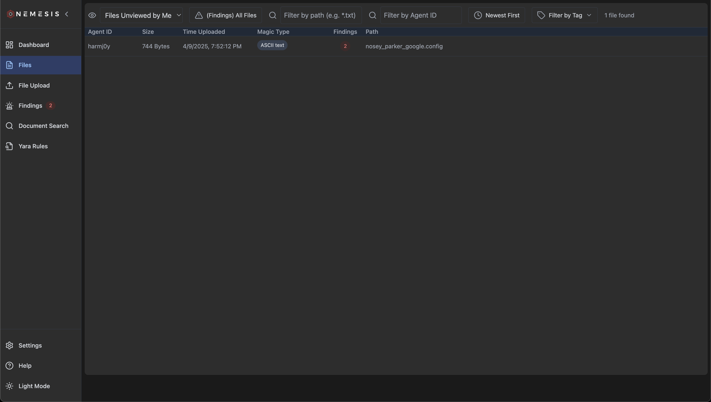

As files are processed by Nemesis, they will appear as lines on this page. By default the files will be sorted newest to oldest, but this can be modified by clicking the "Newest First" button at the top which will switch it to showing the oldest first.

Likewise, the "(Findings) All Files" is the default (showing all files), but clicking shows just files with findings. The "Filter by path" text entry can be used to filter by file path/name/extension, and entries can be filtered by agent ID.

When clicking on a file entry, you will be brought to the [File Details](#file-details) page. After viewing a file, the entry will be hidden by default on the "Files" page - click the "Files Unviewed by Me" entry on the top left to view select "Unviewed Files" to show files not viewed by anyone (including you), or "All Files" to view all files regardless of view state:


#### File Triage Mode

In the main files view, type `t` to enter file triage mode:


As the instructions specify, Use ↑↓ to navigate. Use Shift+↑↓ to select multiple rows. Ctrl/Cmd+A to select all. 'v' to mark as viewed, or ESC to exit. Only the files currently showed by the specified filters you've applied will be marked as viewed. These files will then be hidden from the main triage pane.

#### File Details

Clicking on a file entry in the "Files" view brings you to a file details view:


On the top left of this view, you'll see basic metadata like the file name, magic/mime types, MD5/SHA1 hashes, etc.

Press **[tab]** to autoscroll (or scroll manually) to get to the "File Content" view. Here, different tabs will display the summaries and transforms for a file. Pressing `p` will cycle between these views:


Any plaintext file identified with a specific file type will be rendered with that using the [Monaco](https://github.com/microsoft/monaco-editor) code editorL

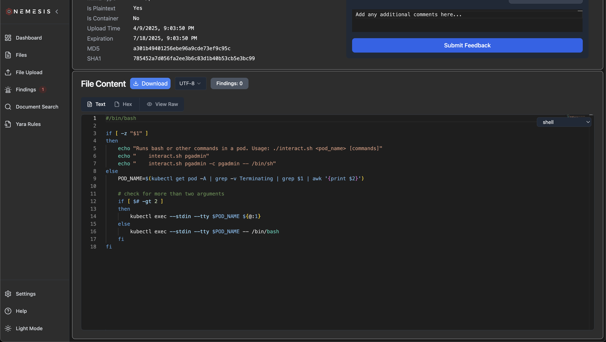

If you scroll to the bottom of the page past "File Content" you cans see some basic details about the file enrichment workflow, including any successful and failed enrichments. Mousing over any failed enrichment module nodes will reveal a basic error message.


If an enrichment module is failing on your file, we recommend using [the Loki logs in Grafana](./troubleshooting.md#grafana) to help track down what's going on (tip: using the file's `object_id` UUID can help track down specific log lines).

#### File Tags

In the file details view, clicking the "+ Add Tag" button will allow you to create new tags, or add existing defined tags, to the file:


These tags will persist in the display, and can be used to filter files in the main files view:


### Manual File Upload

Files can be manually uploaded through the Nemesis dashboard via the `File Upload` tab on the left navigation bar. The "Project Name" will be auto-completed, and the "Expiration Time" will be auto set for 100 days in the future (this can be changed in the "Settings" button on the bottom left). The "Originating File Path" is optional but recommended. Files can be dragged/dropped into the upload modal, and on successful submission Nemesis will display the following message:


The file will then be displayed in the [Files](#files) page as soon as it's done processing.

### Document Search

Nemesis indexes the full text of any plaintext file, or the extracted plaintext of any plaintext that can have ASCII/Unicode text extracted. This is stored in the PostgreSQL backend and searchable through this interface. Partial document matches will be shown, while clicking on the file name will take you to the file details page:

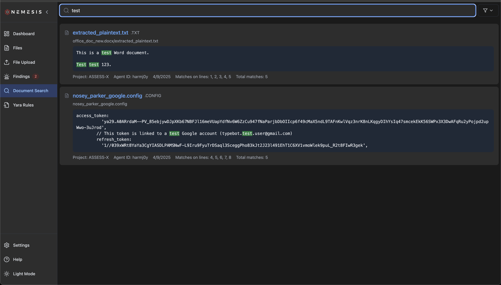

Clicking the topright filter icon will bring down filters you can apply for searches:

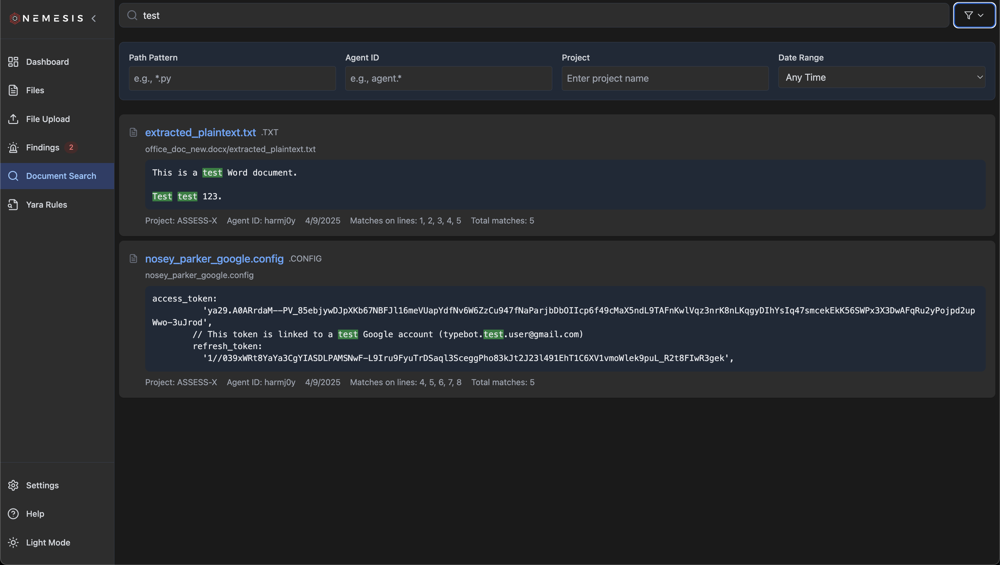

### Findings

One of the other common tasks for the dashboard is findings triage, accessible through the `Files` page on the left navigation bar:

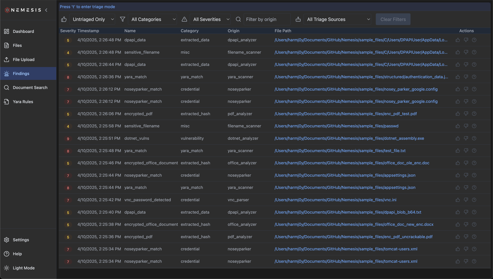

Clicking on a finding brings up details for the finding:

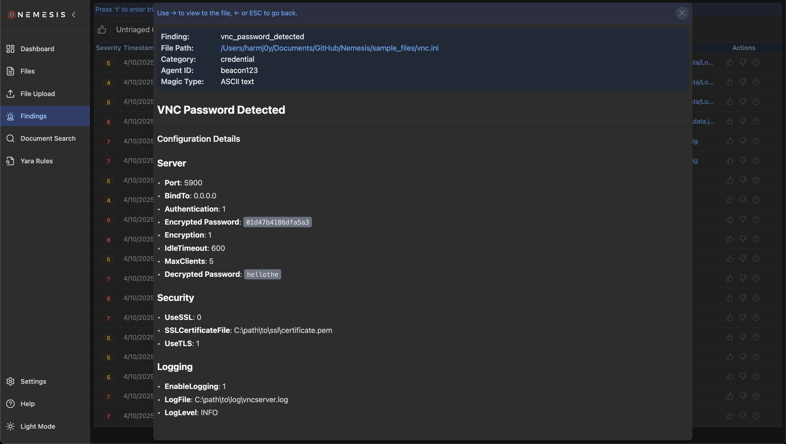

Clicking the hyperlinked file path will take you to the file details page for the file the finding originates from.

You can filter findings by triage state, category, severity, module origin, and triage source (human/automated) at the top of the table.

Like with the `Files` page, type `t` to enter triage mode. This will add a check box to the currently selected file along with displaying keyboard actions you can take:

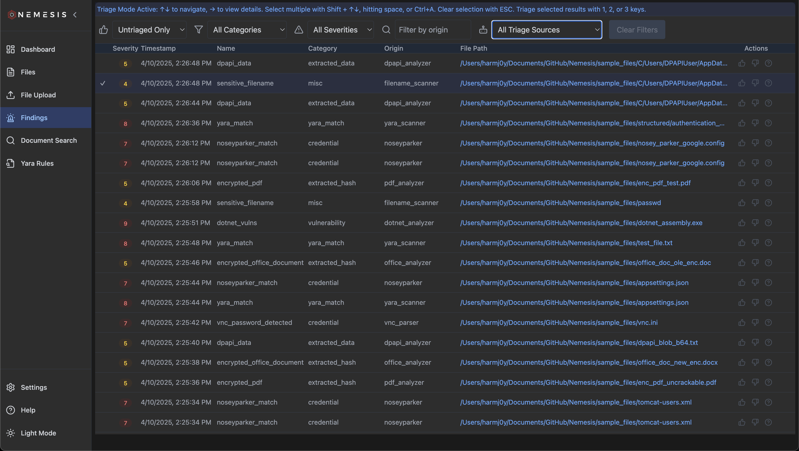

As the text details, use ↑↓ to navigate findings, → to view finding details details. You can select multiple with Shift + ↑↓, hitting space, or Ctrl+A. Clear selection with ESC. Typing 1, 2, or 3 will set the finding as true positive, false positive, or unknown:

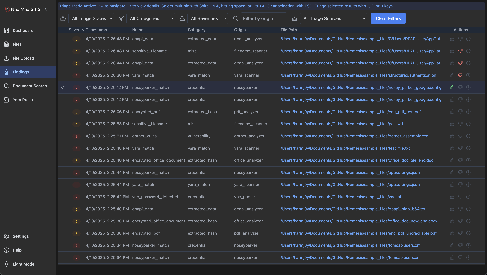

When combined with the default "Untriaged Only" filter, this allows you to easily and collaboratively triage a large number of findings.

### Dashboard Settings

Navigating to the "Settings" menu reachable in the bottom left of the Nemesis interface will take you to the settings page:

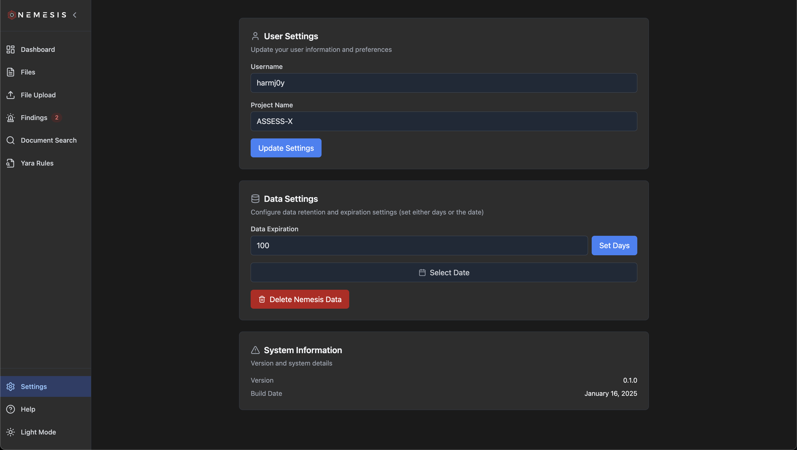

Here, you can change your username/project ID, as well as modify the data expiration (in absolute date or number of days), and can clear the Nemesis database and datalake.

Clicking the "Light Mode" or "Dark Mode" menu button in the bottom left will toggle display mods for the application

## Alerting

If Slack alerting is enabled (i.e., if the `APPRISE_URLS` ENV variable is set), alerts on "interesting" files (e.g., parsed credentials, Nosey Parker hits, DPAPI data discovery, etc.) will be pushed to the configuered Slack webhook/channel with **Nemesis** as the bot user. These messages will contain the alert name, alert category, any additional details, a sanitized file path and a link to the [file details](#file-details) and finding details in the dashboard:


See the [Apprise Wiki](https://github.com/caronc/apprise/wiki) for the string format needed for each alerting service.

### User Feedback

If you want user feedback from the [File Details viewer](#file-details) to be routed for alerting, use an Apprise link like `slack://Nemesis@T...k/#nemesis-feedback?tag=feedback` - this will route user feedback actions to that specified channel, with regular alerts going to any configured channel without the feedback tag.

You can configure multiple Apprise URLs for alerting and user feedback (i.e., alerting to multiple services).

## Submitting Files via the API

You can submit files using Nemesis's `submit` CLI tool:
```bash
./tools/submit.sh
```

Uploading a with curl:
```bash
curl -k -u n:n -F "file=@example.txt" \
        -F 'metadata={"agent_id":"agent123","project":"assess-test","timestamp":"2025-01-29T12:00:00Z","expiration":"2026-02-29T12:00:00Z","path":"/data/files"}' \
        https://nemesis:7443/api/files
```

### API Documentation

Navigating to the "Help" menu reachable in the bottom left of the Nemesis interface will show you the clickable `/api/docs` and `/api/redoc` Swagger and ReDoc API documentation, respectively:

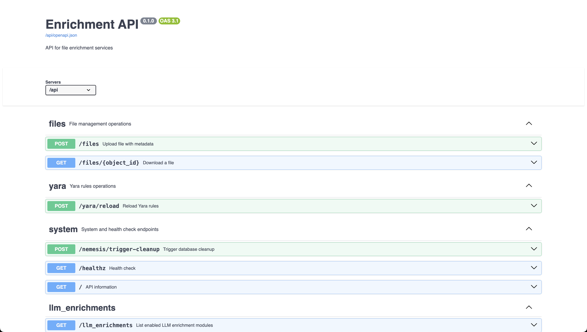

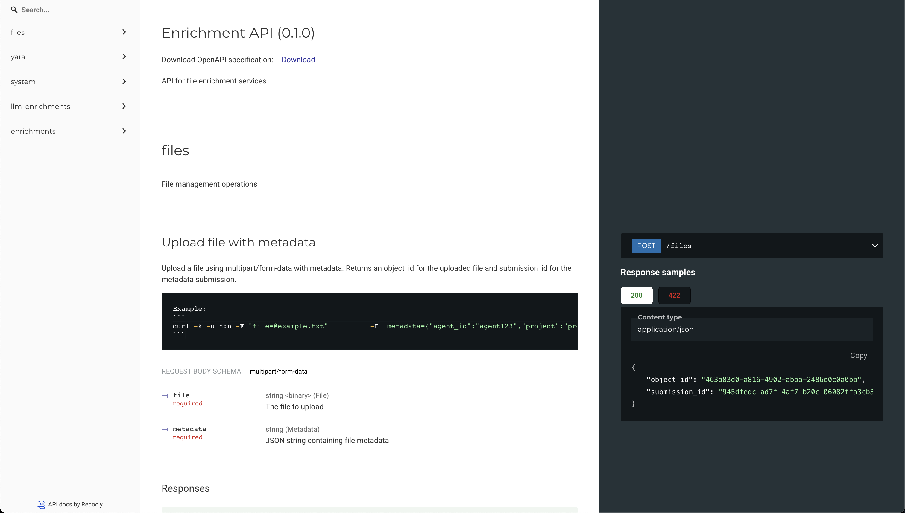